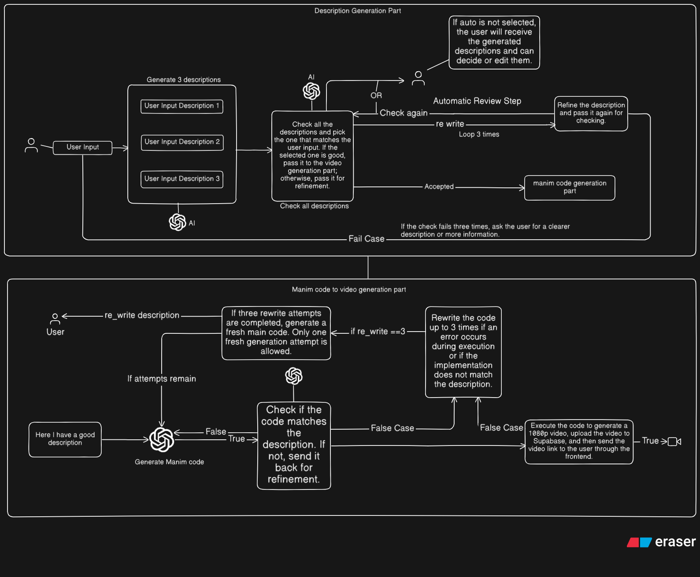

# AI-Powered Manim Video Generator

An intelligent pipeline that transforms simple text prompts into high-quality, 1080p animated videos using the Manim engine and generative AI.

This project automates the complex process of creating mathematical animations. It takes a user's initial idea, refines it through an AI-powered validation loop to create a detailed script, generates the corresponding Python code for Manim, and renders the final video.

## 🎬 Demo

Check out these examples of AI-generated Manim animations:

**Surface 1 Prompt:** Create a 3D surface plot of the function z = sin(x) * cos(y) using a grid. Animate the camera zooming in and rotating around the surface.

**Surface 2 Prompt:** Show a 3D surface plot for sin(x) + cos(y)

| Surface 1 | Surface 2 |
|--------------|--------------|
|  |  |


## ✨ Key Features

- **AI Script Generation**: Automatically expands a user's idea into multiple detailed scene descriptions.
- **Iterative Refinement**: A multi-step validation system ensures the script is high-quality and accurate before generating code.
- **Text-to-Code**: Converts the final, approved description into an executable Manim Python script.
- **End-to-End Automation**: Handles video rendering, uploading to cloud storage (Supabase), and delivering a shareable link to the user.
- **User-in-the-Loop**: While highly automated, the pipeline allows for optional user intervention to review and edit descriptions, ensuring the final output perfectly matches their vision.

## ⚙️ Architecture and Workflow

The project is built around a two-stage pipeline: **Description Generation** and **Manim Code Generation**.




### Part 1: Description Generation

The goal of this stage is to convert a vague user idea into a precise, machine-readable description suitable for code generation.

1.  **User Input**: The process starts with a simple text description from the user.
2.  **AI Expansion**: The AI generates three distinct, detailed versions of the description based on the user's input.
3.  **AI Validation & Refinement Loop**:
    - An AI agent checks the three descriptions and picks the one that best matches the original intent.
    - The chosen description enters a refinement loop (up to 3 times) where it's automatically improved and re-checked for quality.
    - If the AI cannot produce a satisfactory result, the user is prompted to provide more information or clarify their request.
    - A user can also manually inspect, edit, and approve a description at this stage.
4.  **Output**: Once a description is marked as "Accepted," it is passed to the next stage.

### Part 2: Manim Code & Video Generation

This stage takes the approved description and handles all technical aspects of creating the video.

1.  **AI Code Generation**: The refined description is passed to a generative AI model that writes the Python code required to create the animation using the Manim library.
2.  **Code Validation**: The generated code is checked to ensure it accurately implements the description. If it doesn't match, it is sent back for refinement.
3.  **Execution & Rendering**: The final, validated code is executed. Manim renders the animation into a 1080p MP4 video file.
4.  **Storage & Delivery**: The video is automatically uploaded to a Supabase storage bucket, and a public link to the video is sent back to the user through the frontend.

## 🛠️ Technology Stack

-   **Core Animation Engine**:
    -   [Manim](https://www.manim.community/)

-   **Backend**:
    -   [Python](https://www.python.org/)
    -   [FastAPI](https://fastapi.tiangolo.com/) for the web server
    -   [Pydantic](https://pydantic.dev/) for data validation

-   **AI & Orchestration**:
    -   [LangChain](https://www.langchain.com/) & [LangGraph](https://langchain-ai.github.io/langgraph/) for building the agentic pipeline
    -   [LangSmith](https://www.langchain.com/langsmith) for debugging and observability
    -   Generative AI Models (e.g., GPT, Gemini)

-   **Frontend**:
    -   [React](https://react.dev/)
    -   [Material-UI (MUI)](https://mui.com/) for UI components

-   **Database & Storage**:
    -   [PostgreSQL](https://www.postgresql.org/)
    -   [Supabase](https://supabase.io/) for video storage and delivery

## 🚀 Getting Started

Instructions on how to set up and run this project locally will be added here.

### Prerequisites

- Python 3.9+
- FastApi
- LLM Api Key

### Installation

1.  Clone the repo
    ```sh
    git clone https://github.com/SurajPatel04/mainVideoGenerate.git     
    ```
2.  Install backend dependencies
    ```sh
    cd backend
    pip install -r requirements.txt
    ```
3.  Install frontend dependencies
    ```sh
    cd ../frontend
    npm install
    ```